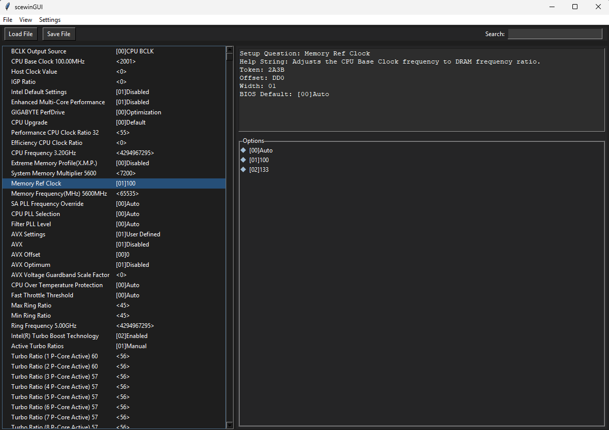

# SCEWIN-GUI

SCEWIN-GUI was made to ease the pain of editing NVRAM files produced by SCEWIN / AMISCE

## Features

- Load and save NVRAM files
- View and edit BIOS settings
- Apply custom themes
- Search and filter settings

## Requirements

- Python 3.x
- Tkinter

## TODO
A LOT - I probably cba due to spending most time studying, this is still very poorly made  
Such as configs for SCEWIN, included presets, implement a way to change multiple entries of the same setting, to the same value, if it exists.

## How to Run

1. Clone the repository.
2. Open Command Prompt or PowerShell with administrative privileges.
3. Navigate to the directory containing the script.
4. Run the script using the command: `python main.py`.
5. Use the GUI to open, edit, and save NVRAM files.

## Download

The executeable can be downloaded from also just be downloaded from [Releases](https://github.com/eskezje/scewin-gui/releases)

## Preview

## Acknowledgements

Tested with `nvram.txt` produced by [SCEHUB](https://github.com/ab3lkaizen/SCEHUB).  
Should also work with other versions.
